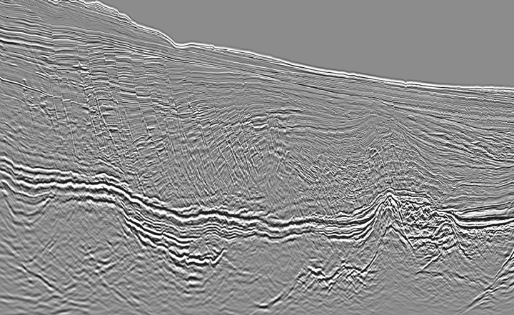

Many highly skilled Geophysicists are currently considering a career change to "Data Science". Leaning on my brief time as a Data Processing Geophysicist, I would like to shed some light on the commonalities and dissimilarities of this role with Data Science.

## The picture today

The volatility and general collapse of the price of oil has caused big ripples down the Oil & Gas industry. Many Geophysicists are now considering more seriously than ever the prospect of pivoting careers - and one of the most popular routes seems to be Data Science.

Since I made that pivot back in 2015, demand for "Data Scientists" has increased significantly, while the supply, especially for entry-level positions skyrocketed. Today this job title is well in the mainstream and Data Scientists can be found across a bunch of industries. However, it remains to be seen how profound the impact of Covid will be on this proliferation, keeping in mind that late adopters who have yet to realise noteworthy business value may decide to cut their losses.

This situation might paint an intimidating picture for Geophysicists looking to make this career change. However, I think that Geos possess a scientific skillset that can give a competitive advantage.

With this post I want to achieve 2 goals:

> **1. Raise  employer/recruiter awareness** that Geophysicists are true multidisciplinary beasts that can potentially be great hires for Data Science roles

> **2. Help Geophysicists identify and "market" their transferrable skills**, and understand the core improvement areas with the highest leverage.

**!Disclaimer!**: My perspective draws from my experience working as a "Time Processing" Geophysicist in marine seismic data processing 5 years ago. It was considered the less illustrious precursor for "Depth Imaging", which perhaps required a slightly different set of aptitudes. Therefore, my opinions could be to some extent outdated and too generic.

## TL;DR

### What Geophysicists do (at a super high level)

Seismic data is acquired by stimulating the earth with high energy seismic waves, that are subsequently reflected by the various geological layers and collected by specialised receivers on the surface. Geophysicists process and model this data to transform it to a 3D image of the subsurface. Oil & Gas companies buy these images at a steep price and analyse them to identify pockets of geology with high probability of extractable hydrocarbons.

### Geophysicist strengths

**1. Very high attention to detail**

Data processing workflows are highly complex, and lots of things can go very subtly wrong. Attention to detail is paramount!

**2. Testing organisation and discipline**

Before Geophysicists start testing different algorithms and parameters, they create meticulous testing plans and make progress by testing one intervention at a time, as mistakes cannot be hidden and are very costly! In my experience, rarely is a Data Scientist as disciplined with testing as a Geophysicist. Experiment tracking is second nature to a Geo!

**3. Data management**

Vast amounts of data split across a large number of datasets are generated with each processing step, so careful data and compute management is one of the main acquired skills of Geos.

**4. Project delivery under pressure**

Project management tends to be waterfall, therefore slipped deliverables become quite likely to occur. This puts Geos under big pressure to deliver highly complex projects to high stakes clients (major multinationals). 

**5. Understanding of time series (from Digital Signal Processing perspective)**

DSP and time series spectral analysis is not the most common tool in the arsenal of Data Scientists, but is part of the daily life of the Geophysicist.

**6. High quality technical writing**

Geophysicists regularly produce highly detailed technical reports for internal and external stakeholders that are peer-reviewed by scientific support teams.

### Top leverage areas for Geophysicists to improve

**1. Basic Probability and Machine Learning**

Unfortunately basic tenets of Probability and Machine Learning do not seem to play a big role in seismic data processing, although in my opinion [they really should](https://www.earthdoc.org/content/papers/10.3997/2214-4609.20130884). Introductory MOOCs can be helpful to bridge the gap.  

**2. Programming & Software Engineering**

Geophysicists typically work on proprietary GUI-based software platforms, so coding is not a big part of the job. Proper software engineering foundations are tricky to build for people with a classic Applied Science degree, but there are now many MOOCs that can help there. Obviously, learning Python is the way to start, but overuse of Jupyter Notebooks can amplify bad habits. [Luciano Ramalho's Fluent Python](https://www.goodreads.com/book/show/22800567-fluent-python) is a fantastic resource to learn Python. Also, contributing to welcoming Open Source projects can be a good way to build up skills. Oh and SQL is a no-brainer.

**3. Cloud computing**

Massive proprietary data centres was how this industry rolled when I was working there. Assuming this hasn't changed, learning some cloud skills by, say learning how to deploy a dockerised Streamlit application on AWS (blog post coming soon) would be very beneficial in my opinion.

**4. Learning the difference between waterfall and Agile**

The dysfunctions of waterfall usually outweigh the pros in my experience. [Marty Cagan's "Inspired"](https://www.goodreads.com/book/show/35249663-inspired) is good reading material to help internalise the differences. Also, the siloed responsibilities of Geophysicists (such as Time Processing and Depth Imaging separation) is an anti-pattern that savvy tech companies try to avoid.

**5. Embracing the vibrant Data Science "scene"**

Allocating time to stay on top of developments in tech and Data Science is almost a prerequisite nowadays. The open culture of the field is quite in contrast to the Oil & Gas sector. Being proactive in broadening one's horizons by following key Twitter accounts, news sources, Github profiles, etc is very important.

## The longer version: Geophysicists and Data Science

> **Image** : **Seismic data [source](https://www.offshore-mag.com/geosciences/article/14178747/tgs-pgs-issue-offshore-labrador-3d-seismic-data)** (*it's painful to look at but there is a crazy amount of info packed into this ugly grayscale image*):
>
> 

Geophysicists work with seismic data. Seismic data are basically spatio-temporal time series that Geos process using signal processing algorithms - a Fourier paradise. The software used is, at least to my experience, proprietary closed source GUI applications with a pre-defined set of parameterisable modules. An interface reminiscent of Dataiku/RapidMiner/SPSS Modeller I guess.

So unlike (most?) Data Scientists, Geos don't have to write code, BUT their job has a very real applied science element - even more so than many Data Scientist jobs. Let me explain.

Turns out that seismic processing workflows are generally not repeatable. What works on one dataset will almost never work on another one, as data quality is extremely prone to variability, due to effects from acquisition configuration, geology, environmental noise and other reasons. So a large amount of testing is involved in figuring out optimal preprocessing flows and their hyperparameters - arguably this is the core responsibility of the Geo. Heavy use of attribute analysis is involved in that and, yes, eyeballing vast amounts of weird-looking data.
Interestingly, during my time, grid-searching was not realistic due to computational limitations of the on-prem cluster. But clearly, so much room for intelligent automation there (think auto-ML)!

In the start of each processing step geos create a testing plan, a peer-reviewed and audited first class citizen of the project management process. The motivation behind this is the magnitude of processing required. We're talking TB's of data going through each processing step. Runs can take days! So getting the workflow wrong has big $$ implications. This situation forces the Geo to be rather deliberate about what they test and why based on the peculiarities of the dataset. And really importantly, Geos learn to test the effect of *one intervention at a time*.

Arguably, it just happens that this **is** science. And in my career as Data Scientist I have rarely seen people show a similar level of diligence in organising their assembly of preprocessing, feature engineering and modelling pipelines. Disorganised testing with little understanding of the underlying dataset quirks almost always leads to suboptimal results and missed optimisation opportunities. Yet still, this is usually the status quo. Automation does not offer a silver bullet; the cardinality of preprocessing, feature engineering and modelling workflow configurations is way too large to grid-search. But a thoughtful testing plan can constrain that set down significantly. So I think that the Geophysicist's scientific approach over testing is a big big plus!

In terms of project management, it was very very waterfall. Processing is broken down into steps, each of which is very meticulously planned. I was "lucky" to experience how waterfall can go wrong. Unrealistic delivery estimates and client problems/surprises with big-bang deliverables were clear artefacts of this style of project management. This frequently put Geos under considerable pressure to deliver against strict contractual deadlines - and when your clients are Oil & Gas multinationals then the pressure is even more on!

Working in Agile teams is a pretty big departure from this style of working, and one that may be very unnatural to a Geo. On the other hand, Geos do start assuming project management and client interaction responsibilities very early in their careers, and are responsible for high-stakes deliverables. Within the first couple of months of my Geo career, I was entrusted to create a client data deliverable. After running the preprocessing over a couple of days, I requested our Ops team to record TBs of data onto 10s of magnetic tapes which they duly completed over the course of another 2 days. As you can guess, this was a fairly manual and painful process for my Ops colleagues, who weren't particularly ecstatic when I confessed I made a little mistake and the whole job had to be rerun :(

## My short career as a Geophysicist

As an MSc student at the University of Leeds back in 2012, I was offered an opportunity to do an internship, as part of my dissertation. (At a real, global company based in the UK! And I would get a salary!!)

The company that would host me was a big player in "Oil & Gas services" doing "marine seismic data acquisition and imaging". As a Statistics student that meant little to me at first. I soon found out that the company operated a fleet of ships that recorded subsurface data (seismic waves reflected by the subsurface after being "bombarded" by acoustic energy from airguns pointing towards it) which would be processed onshore to create 3D images. Oil & Gas companies would buy these image datasets (biiig data in tape format), and analyse them to pinpoint locations with a reasonable probability of extractable hydrocarbons.

My internship was research-focussed and explored ways that Machine Learning could automate legacy, manual workflows in Data Processing. I had lots of fun and learned a great deal from really intelligent researchers over those few months. My key takeaway was that ML can bring REAL business value and that some industries are ripe for disruption. I learnt that back then the industry was consuming around 20% of the world's compute; with all that data and manual processes, I was starting to think of a few interesting ideas.

At the end of my internship the company made me a *real* job offer, my first, which I elatedly accepted. It didn't really matter at the time that the role offered was as a "Geophysicist"; I had enjoyed my experience immensely and was willing to give it a chance, although I knew next to nothing about Geophysics.

Over the next couple of years I learned much about this niche and closed industry, and Geophysicists. At some point though I realised that facilitating hydrocarbons extraction was not what I wanted to do in my career, so  it was time for a change.

For me, the Data Scientist path was the most natural one to follow, based on my good Mathematics/Statistics/ML academics and relevant previous industry experience. But pivoting to a role with "Data Scientist" in the job title back in 2015 was the **hardest** thing I have done career-wise. It was frustrating that the Geo experience seemed "alien" to almost all recruiters and employers I spoke with! So I had to learn to convey succinctly what on earth (no pun intended) my job was about and how it was relevant. Thankfully there were plenty of opportunities for me to practice and refine the pitch and eventually a company gave me the chance I'd been hoping for.

## Epilogue

Pivoting careers is not easy. In the case of the Geophysicist, this is compounded by the role's relative obscurity. But persistence, tailored applications, demonstrable motivation and commitment to the desired target along with succinct communication will eventually pay off!
