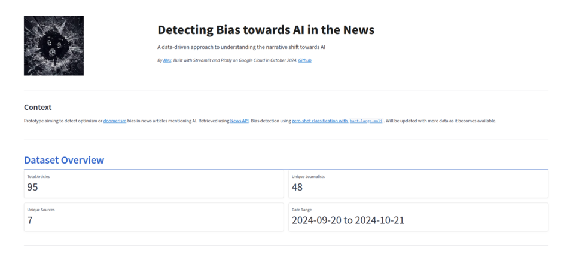

This post shows the development of a webapp that tracks bias of news articles relating to AI.

I prioritise the end-to-end solution architecture, rather than the Data Science side: building a mini-data platform on GCP that showcases core features of what is called the "Modern Data Stack" and relevant Data Governance tools.

Below, I showcase a Streamlit app that tracks bias of news articles relating to AI. The app and underlying infrastructure is fully deployed on GCP.

**App**: https://streamlit-app-824805393106.europe-west2.run.app/

**Code**: https://github.com/alejio/news-bias-detection/tree/main


## Motivation
This is motivated by a couple of things. Firstly, as I've worked predominantly with AWS most of my career, I am keen to ramp up my knowledge of the GCP data stack. Secondly, I think that there is still incredible potential and many low-hanging-fruits where NLP can help consumers identify biases in the media we consume. More on the latter another time.

To kick this effort off, I am picking a topic that I find fascinating. About 10 years ago, I first read the famous book by Ray Kurzweil [The Singularity Is Near](https://www.goodreads.com/book/show/83518.The_Singularity_is_Near) and my mind was somewhat blown. More recently, I read Max Tegmark's [Life 3.0](https://www.goodreads.com/book/show/35039471-life-3-0) which I recommend to anyone remotely interested in the topic.

Today there is a fascinating public debate on where AI research is taking the world between the most prominent thinkers and practitioners. Holders of opposing opinions regarding the risks associated with AI have been reductively categorised in public discourse as ["doomers" and "boomers"](https://efi.ed.ac.uk/openai-chief-executives-firing-rehiring-casts-new-light-on-the-war-between-ai-doomers-boomers/). Some proponents either side of the debate have been accused of basing their opinions on commercial rather than intellectual or scientific interests.

Meanwhile, news reports are constantly coming out on the topic. I am curious to get a sense of how the conversation is trending over time and across news outlets (or journalists)!

## The app

The Streamlit app is deployed on GCP and can be found [here](https://streamlit-app-824805393106.europe-west2.run.app/).

It shows insights into the bias of news articles containing the term "AI" over time, and is updated daily as new articles are ingested into BigQuery  and enriched using a `transformers` pipeline.




## MVP Solution Architecture

I put together an MVP, a first iteration of a solution done without thinking deeply about the various individual components, but which allows incremental improvement. My goal here is to get something working end-to-end, and then iterate on it.

The entire solution is hosted on GCP under a single project using:
- Cloud Run for the Streamlit app
- Artifact Registry for storing the Streamlit app Docker image
- Cloud Functions for the daily ingestion of news articles and bias fields enrichment
- Cloud Scheduler for scheduling the ingestion
- BigQuery for storing the news articles and enriched fields


**Prototype architecture:**


This architecture can also be viewed from a Data Platform lens:

- **Ingestion layer**: Cloud Function and Cloud Scheduler
- **Storage layer**: BigQuery
- **Processing layer**: Bias classification Cloud Function
- **Consumption layer**: Streamlit App

A very useful relevant guide is the [Data Analytics Lens](https://docs.aws.amazon.com/wellarchitected/latest/analytics-lens/reference-architecture.html) of the AWS Well Architected Framework.

## Components

### News API

After some quick searching I came across [NewsAPI](https://newsapi.org/), which can be used to retrieve news articles across many sources and languages. 

There is an amazing `/everything` endpoint which allows filtering by keyword, but the free version is very limiting: only 30 days of history, only 100 news articles and truncated content 😢. 

It will do for now though.

I decided to focus my analysis on all articles that contain the term "AI" - a wide net that will hopefully not excessively bias a priori the analysis.

Sample code:

```python
import requests
from datetime import datetime, timedelta

NEWS_API_URL = "https://newsapi.org/v2/everything"
NEWS_API_KEY = os.getenv("NEWS_API_KEY")

def fetch_news():
    """
    Fetch news articles from NewsAPI
    """
    # Calculate date range
    end_date = datetime.now().date()
    start_date = end_date - timedelta(days=30)

    params = {
        "apiKey": NEWS_API_KEY,
        "q": "AI",
        "language": "en",
        "from": start_date.isoformat(),
        "to": end_date.isoformat(),
    }

    response = requests.get(NEWS_API_URL, params=params)
    all_articles = response.json().get("articles", [])
    print(f"Articles fetched: {len(all_articles)}")
    return all_articles
```


Considering I only have access to the 30 previous days of news history via the API, it would be useful to have my dataset grow over time.

## Ingestion layer: Cloud Function and Cloud Scheduler
I used the Cloud Function SDK to write a simple function that fetches news articles from the NewsAPI and stores them in BigQuery.

Due to the API limitations, it was important to schedule it to run daily, to enable, over time, to get more useful insights about the nature of the AI discourse.

I used Cloud Scheduler to schedule the function to run daily - cron job style.


## Storage layer: BigQuery
Well, one could argue that for the purposes of this exercise, BigQuery is overkill, and that a simple Postgres database would have sufficed. But that would defeat the purpose of this work.


Considering the tiny size of the dataset, I did not need to worry about partitioning or other optimisations for the Data Warehouse layer.
 a a a
I used the URL as the primary key for the table, as it was unique - although that is clearly not best practice.

## Processing layer: Bias classification Cloud Function
Being time constrained,I was looking for an out-of-the-box solution to infer the relevant bias of the article authors.

Even without optimising the NLP aspect, my solution was limited by design: it was done on a document-by-document basis, and using only the description field of the article, as the content from News API was truncated and less meaningful.

I initially considered using Google Cloud Natural Language API, but eventually opted against procuring another GCP service. Instead, I used a `transformers` pipeline.

The model I chose was [`facebook/bart-large-mnli`](https://huggingface.co/facebook/bart-large-mnli), which is a general-purpose, multi-task classification model that importantly supports zero-shot classification.

As I put time constraints on my efforts, I resisted my Data Science instincts to experiment, and used it as-is. 

That was the right decision because getting the Cloud Function to work was tricky - I had to experiment with memory, CPU and timeout settings quite a bit to get it to work.

Sample code (probably the tiniest ML pipeline I've ever written):

```python
def classify_content(row):
    """
    Classify description using zero-shot classification.
    """
    labels = ["AI Boomer", "AI Doomer"]
    result = classifier(row['description'], labels)
    # Return the most likely label (highest score) and its corresponding score
    return result['labels'][0], result['scores'][0]  # (category, score)
```

Meanwhile, I would have liked to trigger this function immediately after new news articles are ingested into BigQuery. Alas, such triggers are not supported and going down a Pub/Sub rabbit hole was out of scope.


## Consumption layer: Streamlit App

I have loved Streamlit since it came out, it gives Data Scientists superpowers  - although I don't think it has evolved a lot from an OSS perspective since being acquired by Snowflake ($800m ??).

Cursor + Claude Sonnet 3.5 were a massive help with developing the Streamlit component, and I have no guilt in using it!

For me, Data Analysis is a highly intuitive "flow" activity and having to think about the syntax of arbitrary visualisation libraries whilst exploring adds unnecessary mental overhead. 

With an AI code editor I could focus on EDA, and storytelling while letting the AI handle the nitty-gritties of plotly and matplotlib.

You can see the app in action [here](https://streamlit-app-824805393106.europe-west2.run.app/).


