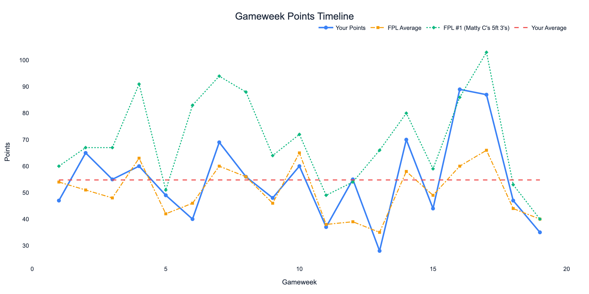
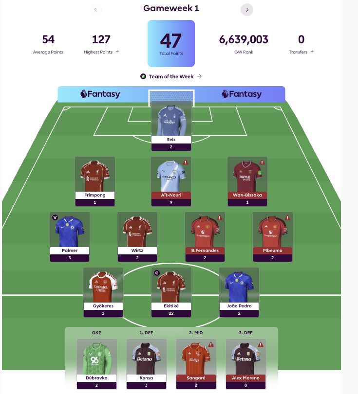
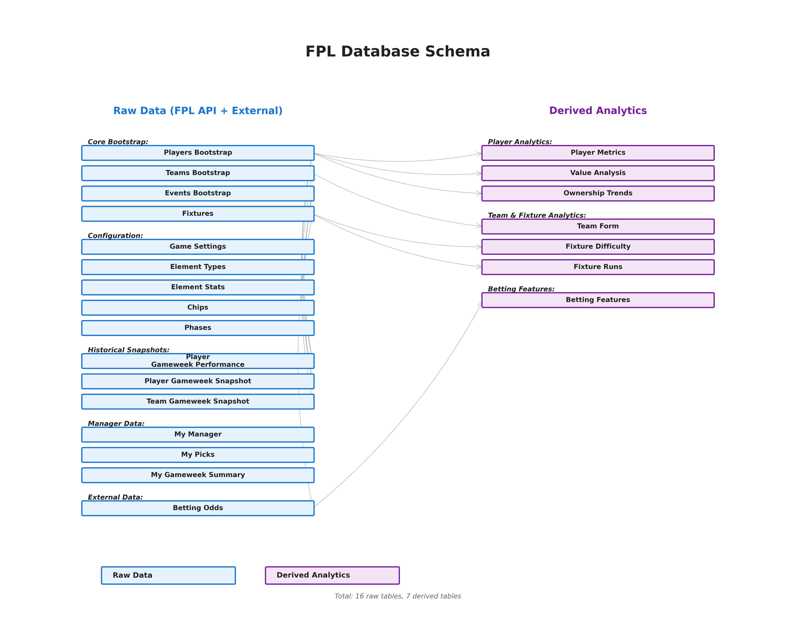
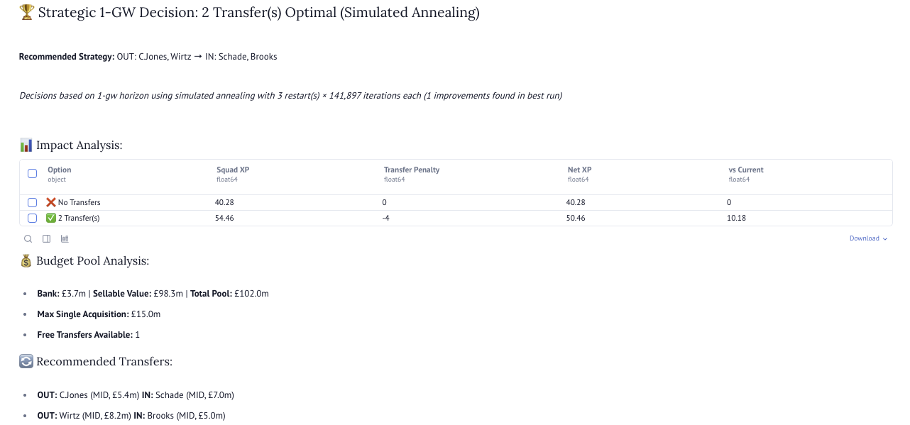
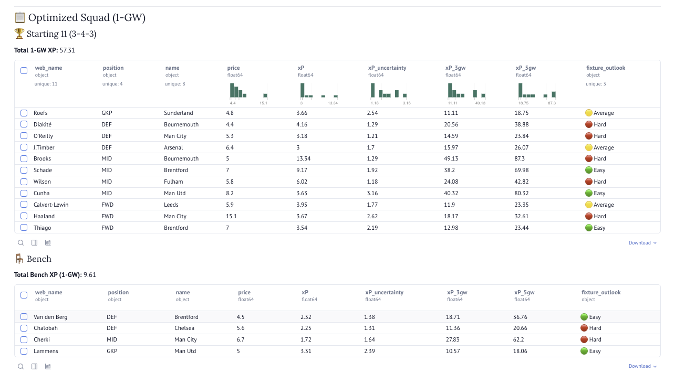
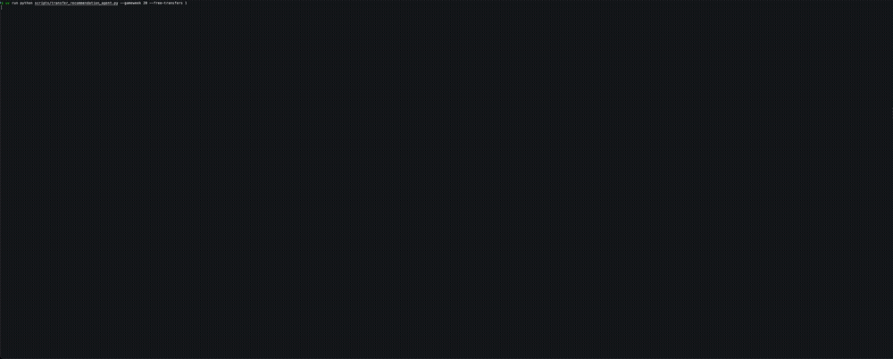
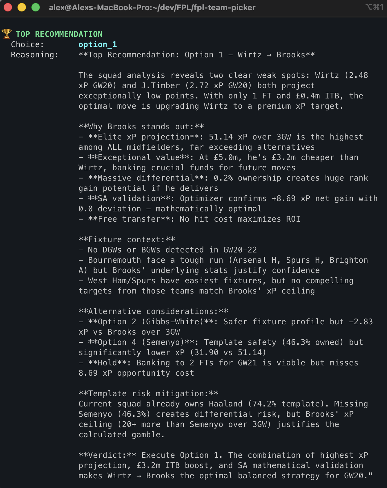
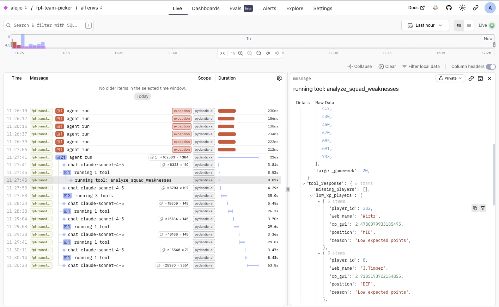

Kicking off a series of posts (number TBD) documenting the development of an ML system for Fantasy Premier League.

Gameweek 19. The exact midpoint of the Premier League season.

6 months of work. 380+ commits. 800+ tests. 10 evals. A production-ready system.

This isn't a success story. At least, not yet.

*Points per gameweek compared to FPL average and the current #1 manager*

---

## What is FPL?

For the uninitiated: Fantasy Premier League is a free-to-play fantasy football game where you select 15 real Premier League players within a £100m budget. You earn points based on their real-world performances (goals, assists, clean sheets), make weekly transfers to optimise your squad, and compete against millions of other managers in a global leaderboard.

For me, it's an excellent ML playground:

- **Bounded domain**: 15 players, £100m budget, clear rules
- **Weekly feedback loop**: no hiding from results
- **Rich data**: years of history, real-time updates, betting markets
- **Real competition**: 11M+ active players, measurable ranking

You can't hide behind vanity metrics when your rank is public. Every week, the system gets tested against millions of other decision-makers. The skin in the game is real.

---

## Why I'm doing this

I wanted a project where I could apply end-to-end data work without the restrictions a professional environment imposes: from data collection to ML to agentic systems, in a domain with clear, measurable outcomes.

Also, I got tired of consecutive years of sucking at FPL and decided to finally combine my professional specialty with one of my hobbies.

And despite all that sophistication? I'm currently ranked around 2.7 million out of 11 million managers 😅

Refreshingly, I'm +86 points above the average manager. But more interestingly, I think the system is finally converging to something good.

---

## The journey so far

5 months. 395 commits. 833 tests. 25 database tables. 15 domain services.

The architecture progressed through three distinct phases:

| Phase | Focus | Key Outcome |
|-------|-------|-------------|
| **Manual Control** | Interactive notebooks, rules-based picks | Learning the domain |
| **ML Predictions** | 156 features, custom loss functions | Better signals |
| **Agentic Reasoning** | LLM + tools, strategic context | Autonomous strategy |

The codebase lives across two repositories: `fpl-dataset-builder` handles data collection and enrichment, while `fpl-team-picker` handles analysis, ML, and the agent.

### Phase 1: Manual control (July–Aug)

I started where every data person starts: interactive notebooks. Specifically, to build a starting 15-player squad picker.

Using [Marimo](https://marimo.io/) (a reactive Python notebook), I built an interface for exploring the data and developing rules-based predictions of expected points. I could understand and tweak the predictions, and implemented a greedy optimiser to pick the best available player at each position under the budget constraints.

I got it to a place where the results made intuitive sense:

I adapted the algorithm to pick the best transfers and starting 11 for each gameweek. But the problem with this rules-based approach was that it didn't allow self-improvement. The system wasn't learning, so I changed the paradigm.

### The data foundation

One thing I'm particularly proud of: the database.

*Database schema:*

25 SQLite tables split into two layers:

**18 raw tables** capturing FPL data:
- 775 players, 380 fixtures, 38 gameweeks
- 13,395 player-gameweek observations
- My 270 picks across 18 gameweeks, chip usage, transfer history
- 190 fixtures with betting odds (Bet365, Pinnacle, market movements)

**7 derived tables** where the real value lives:
- Ownership trends: bandwagon detection, template players, transfer momentum
- Value analysis: points-per-million, buy/sell/hold recommendations
- Fixture difficulty: multi-factor analysis beyond FPL's simple 1–5 rating
- Team form: venue-specific attack/defence strength
- Betting features: implied probabilities, clean sheet likelihood, xG from odds

> **Pydantic validates everything.** This matters more than you'd think: code assistants love adding fallbacks to "make it work" rather than fixing upstream data issues. Strict validation forces correctness at the source.

### Phase 2: ML predictions (Sept–Dec)

With the data foundation in place, I built an ML pipeline with 156 features across categories: form, fixtures, ownership trends, betting odds, injury risk, venue-specific team strength.

Key design decisions:

- Custom loss functions focused on identifying "haulers" (10+ point players), not naively minimising average error
- Evaluation on >2 full gameweek holdout datasets 
- Hybrid training pipeline evaluating unified ML model vs position-specific models for GKP, DEF, MID, FWD (with hyperparameter tuning)
- A simulated annealing optimiser that explores beyond greedy local maxima

*Example of the transfer optimisation results:*

*Example of the starting 11 optimisation:*

But every gameweek still involved multiple "human-in-the-loop" decisions: model training strategy, risk appetite (conservative vs balanced vs aggressive), captain selection, etc. I was still making a lot of arbitrary calls.

### Phase 3: Agentic reasoning (Dec–today)

Predictions aren't enough. Consider this scenario: the ML model says Haaland is 8.2 xP, Salah is 7.8 xP. The optimiser picks Haaland.

But a strategic thinker might reason differently: there's a double gameweek in 3 weeks, should I bank the transfer now? Or take a hit to avoid a price rise? What about template safety if I'm protecting rank?

This is strategic reasoning, not number crunching. The optimiser maximises expected points; it can't reason about context.

So I'm building an LLM agent. It uses the ML predictions as a tool, but adds a layer of strategic reasoning: DGWs, fixture swings, chip timing, template safety. It's experimental, but it's the "brain" in "Engineering an FPL Brain."

*Running the agent CLI:*

What you're seeing: the orchestrator delegating to 5 specialised tools (multi-GW xP predictions, fixture context analysis, SA optimiser validation, squad weakness detection, template player analysis), then synthesising recommendations with strategic reasoning.

*Output of the agent CLI:*

At the moment it's restricted to transfer recommendations, rather than full team and captain selection. I've used [Pydantic AI](https://ai.pydantic.dev/) as the agentic framework for its structured outputs and [Logfire](https://logfire.pydantic.dev/) integration for observability.

*Logfire trace:*

---

## Where this is heading

**Short-term** (next 3–4 months): Refine the LLM agent: more tools, better reasoning, chip planning. Add uncertainty quantification to predictions. Improve captain accuracy (currently 22% hauler rate).

**Medium-term**: Multi-gameweek transfer planning (sequential optimisation). Benchmark against top 10K manager strategies. Automate more of the weekly workflow.

**The ambition**: a system that can reason about FPL at the level of a top player not just crunch numbers, but understand when to take risks, when to play safe, when to go differential.

I don't know if I'll get there. But I'm building in (semi-)public, so you can follow along.

---

## What's next

This is the first in a series documenting the journey. Next posts will cover how the architecture evolved from notebooks to services, and when ML predictions aren't enough (the agent).

I'll share code, experiments that failed, and weekly accountability on how the system performs.

**Next: How the architecture evolved from notebooks to services** - coming soon!

---

Follow along: [LinkedIn](https://linkedin.com/in/alexspanos)