*What 174 features taught me about FPL prediction, and where ML still fails*

*~10 min read*

---

## tl;dr - Key Takeaways

**For FPL managers who don't want the technical details:**

**Model picks for GW22+:** Bruno G., Watkins, Guéhi, Vicario - [full list below](#players-to-watch).

1. **Value efficiency beats star names**: The model's #1 signal is points-per-pound, not raw talent. A £6m midfielder averaging 5 pts/GW is often better than a £12m premium averaging 7.

2. **Recent form matters more than season averages**: The last 2 gameweeks are weighted 2x more than games 4-5 weeks ago. Chase momentum, not reputation.

3. **Premium players are fixture-proof**: Elite players (£10m+) only lose ~20% of their expected points in tough fixtures. Don't bench Salah against City.

4. **Budget players need fixture rotation**: Unlike premiums, budget picks show 2.5x swings based on opponent. Rotate your £5-7m players aggressively.

5. **Caveat**: The model ranks players well but can't reliably pick the single best captain each week (0% accuracy on holdout).

*Want the technical details? Read on.*

---

## The Problem: No Differentiation

Standard regression models trained on Fantasy Premier League data have a curious failure mode: they predict everyone will score 5-7 points with no meaningful differentiation.

This makes sense from an optimisation perspective. Most FPL players score between 2 and 6 points per gameweek. A model that predicts 5.2 for everyone achieves a respectable Mean Absolute Error (MAE). The problem is that this prediction is useless; not because 5-7 is the wrong range, but because it tells you nothing about which players to pick.

FPL managers don't need perfect point predictions. They need to identify **haulers**: the explosive 10+ point performances that separate top managers from the rest. Or, at minimum, reliably rank players so the best options rise to the top. Analysis of top 1% FPL managers reveals the stakes:

| Metric | Top 1% | Average | Difference |
|--------|--------|---------|------------|
| Captain Points per GW | 18.7 | 15.0 | **+24%** |
| Haulers per GW | 3.0 | 2.4 | **+25%** |

Top managers don't just find haulers; they find the *optimal* haulers. The goal isn't minimising MAE; it's identifying which players will explode.

This post describes an ML pipeline I built that achieves both: **1.80 MAE cross-validated, 1.31 MAE on GW20-21 holdout** (33% better than rule-based baseline) whilst specifically optimising for hauler identification. The key innovations are domain-aware feature engineering, a hybrid position-specific architecture, and custom loss functions that penalise missing explosive performances.

### A Note on Design Philosophy

This approach extrapolates from historical data; past patterns predicting future outcomes. Like stock market models, it has a ceiling: top 1% managers may incorporate information the model can't see (injury whispers, press conferences, watching matches). The model prioritises consistency over this potential upside.

---

## Section 1: The Feature Engineering Story

### 174 Features Sounds Like Bloat. It (Mostly) Isn't.

The model uses 174 engineered features across 8 development phases. Each phase solves a specific blind spot that off-the-shelf models miss.

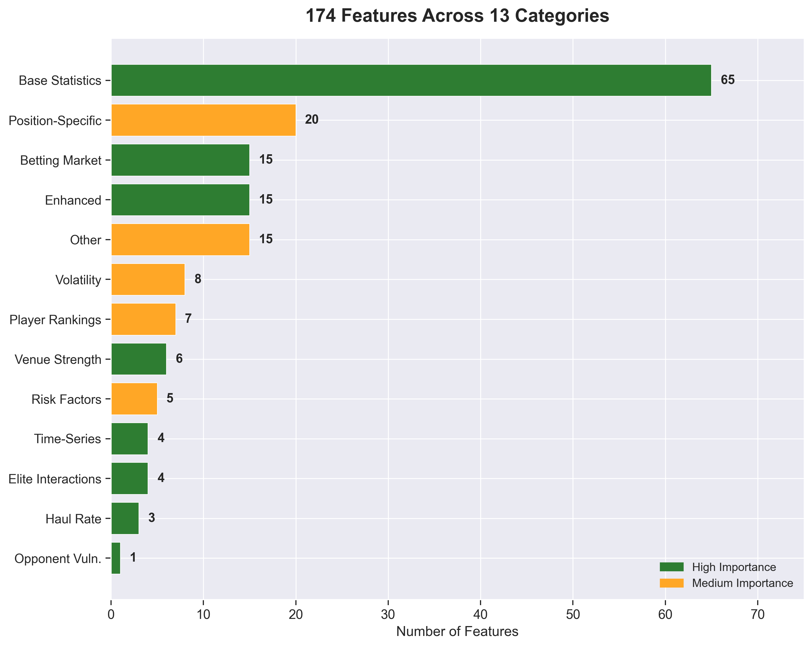
*174 features across 13 categories. Green = high importance features, orange = medium importance.*

What makes this feature set effective isn't the count; it's the systematic iteration. Each phase targeted a known predictive gap.

### The Magnificent Seven: Features That Actually Matter

I ran three independent importance analyses: Mean Decrease Impurity (MDI), Permutation Importance, and SHAP values. Seven features consistently appeared in the top 10 across all three methods, with strong agreement on relative importance:

| Rank | Feature | Importance | Why It Matters |
|------|---------|------------|----------------|
| 1 | **points_per_pound** | 17.4% | Value efficiency beats raw talent. A £6m player with 5 xP > £12m player with 8 xP for squad building. |
| 2 | **ewm_5gw_points** | 11.6% | Exponential weighted form. Last 2 games matter **2x more** than games 4-5 weeks ago. |
| 3 | **value_vs_position** | 10.2% | Positional context. A 4-point defender means something different than a 4-point forward. |
| 4 | **clean_sheet_potential** | — | Defensive security matters as much as attacking returns for DEF/GKP. |
| 5 | **cs_x_minutes** | — | Clean sheet probability × minutes = defensive ceiling. |
| 6 | **rolling_5gw_minutes** | — | Playing time is destiny. No minutes, no points. |
| 7 | **rolling_5gw_ict_index** | — | ICT captures overall involvement: goals, assists, threat, creativity. |

**Key insight**: These 7 features alone provide 60-70% of the model's predictive power. If you only had 7 features, these would be the ones.

The top 3 features account for 39% of total predictions. Notice what dominates: value metrics and recent form. The model cares mostly about *value efficiency and momentum*.

### What Surprised Me: The Underperformers

Several feature categories I expected to be important... weren't:

| Feature Category | Expected Rank | Actual Rank | What Happened |
|------------------|---------------|-------------|---------------|
| **Betting Odds** | Top 20 | #40-70 | Model learns fixture quality from base stats; doesn't need market odds |
| **Haul Rates** | Top 20 | #100-120 | Current form beats historical haul patterns |
| **Elite Interactions** | Top 20 | #44-138 | Premium players don't respond uniquely to fixtures; they just scale with price |
| **Opponent Vulnerability vs Top 6** | Top 20 | #63-92 | Generic fixture difficulty works just as well |

Even more annoyingly: 35 features had 0.0 importance across all three methods. These include all venue-specific features, all ranking features, and all fixture run projections (3GW, 5GW lookahead).

**Practical implication**: I can remove 20% of features (174 → 139) with zero accuracy loss; this means simpler models, faster training, and less overfitting.

### SHAP Reveals the Non-Linear Truth

Some interesting insights come from SHAP dependence plots, which reveal relationships that linear models and simple rules can't capture.

#### Finding 1: Elite Players Are Fixture-Proof

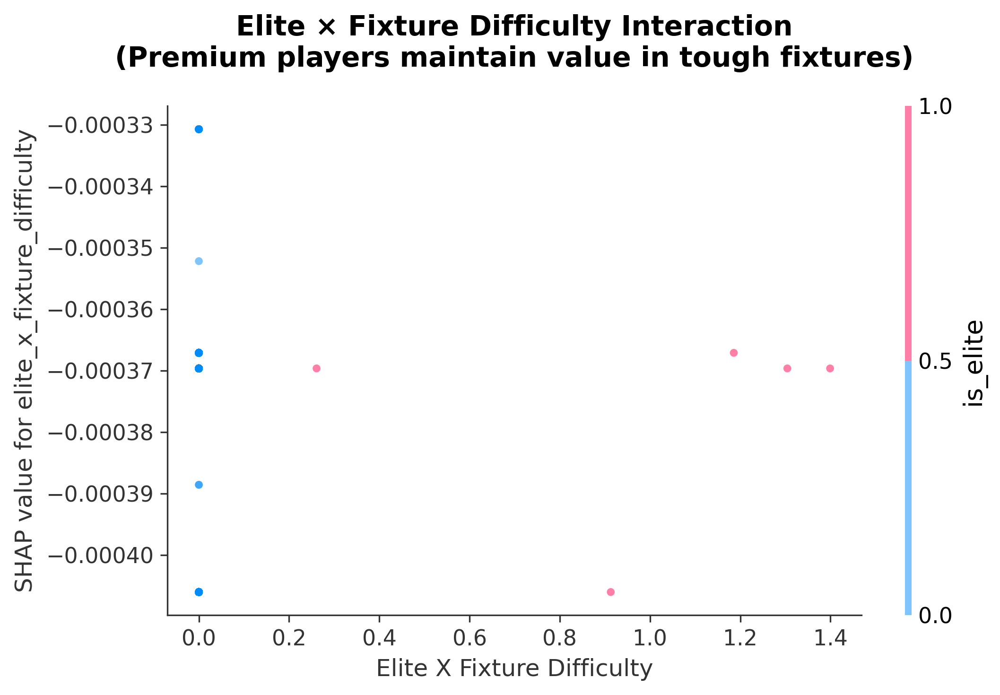
*SHAP dependence plot showing elite player (£10m+) performance across fixture difficulty levels.*

Conventional FPL wisdom treats tough fixtures as near-automatic blanks, with managers often benching players facing top-6 opposition. The SHAP analysis reveals a more nuanced reality:

- **Premium players (£10m+)** lose only **20% of their ceiling** in hard fixtures
- Elite players maintain SHAP values of +0.1 to +0.3 even against top defences
- The penalty is steepest at *mid-range* difficulty (2.5-3.5), not at extremes

**Example**: A premium striker facing a top-6 defence might predict 8.2 xP versus 10.1 xP in an easy fixture; a 19% drop, not the dramatic reduction that conventional wisdom suggests.

**Strategic implication**: Hold premium assets through 2-3 tough fixtures; their floor remains high.

#### Finding 2: Form Amplifies Fixture Quality

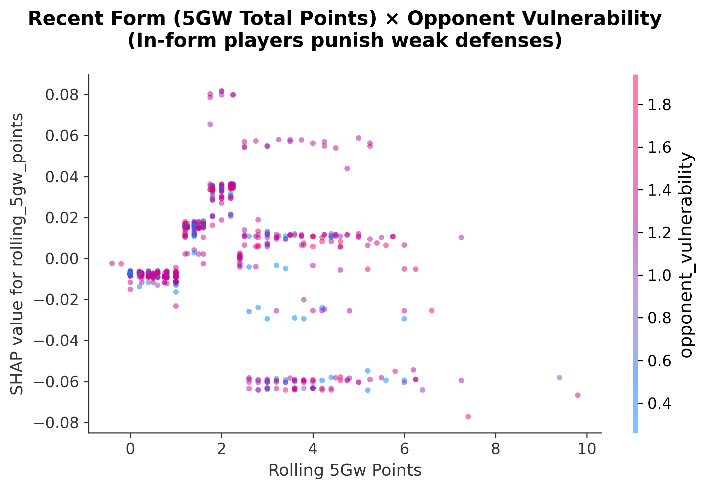
*SHAP dependence plot showing recent form × opponent vulnerability interaction.*

The relationship between form and fixture isn't additive; it's **multiplicative**:

| Form (5GW points) | Weak Opponent | Strong Opponent | Ratio |
|-------------------|---------------|-----------------|-------|
| 35+ pts | +2.0 to +3.0 SHAP | +0.5 to +1.0 SHAP | **3x boost** |
| 25-35 pts | +0.5 to +1.0 SHAP | -0.5 to +0.5 SHAP | 2x boost |
| <25 pts | -0.5 to +0.5 SHAP | -1.5 to -0.5 SHAP | 1.5x penalty |

A player with 35+ points in 5 gameweeks gets a 2-3x boost from weak opponents versus strong ones.

**Strategic implication**:  Form chasing has diminishing returns. By the time a player's rolling form is obvious to everyone, their price has risen and ownership has spiked; you're no longer getting differential value.

#### Finding 3: Budget Players Are Fixture-Dependent

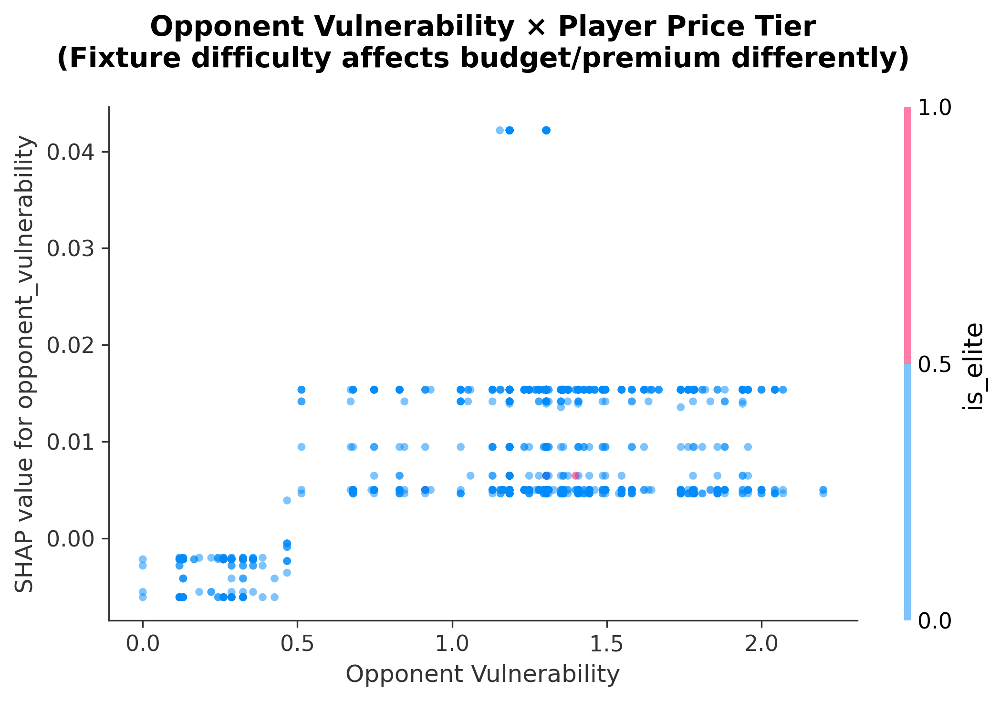
*SHAP dependence plot showing opponent vulnerability × price tier interaction.*

The SHAP spread tells the story:

- **Budget players (£4m-£7m)**: SHAP ranges from -1.0 to +1.5 (2.5 unit swing)
- **Elite players (£10m+)**: SHAP ranges from +0.1 to +1.0 (0.9 unit swing, always positive)

Elite players maintain positive SHAP even against the best defences. Budget players go negative.

**Strategic implication**: Rotate budget picks based on fixture runs; set-and-forget premiums.

---

## Section 2: The Training Pipeline

### Two Phases: Evaluate, Then Retrain

The training pipeline follows a disciplined two-phase approach:

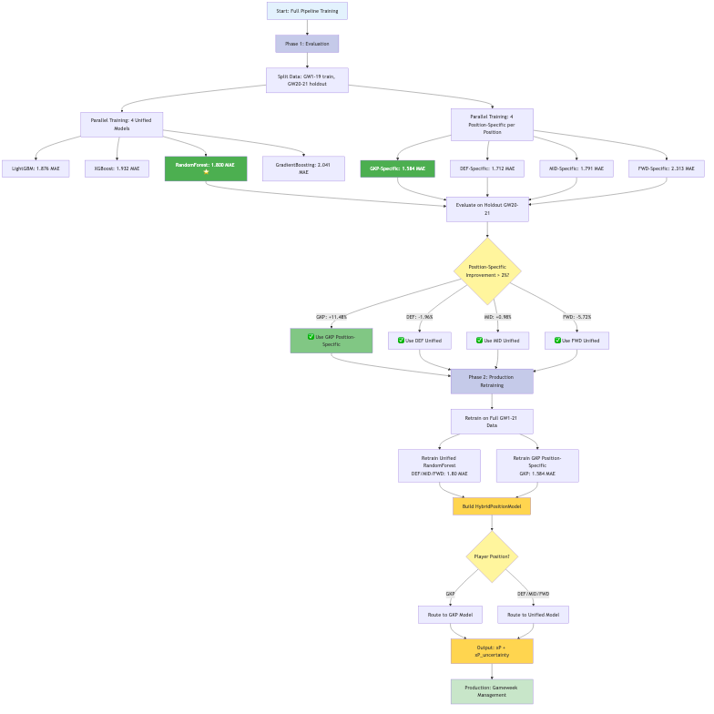
*Full training pipeline from data split to production. Phase 1 evaluates all models in parallel using walk-forward validation. Phase 2 retrains the selected hybrid architecture on the full dataset.*

**Phase 1: Evaluation** (GW1-19 training, GW20-21 holdout)
- Train 4 unified models in parallel (RandomForest, LightGBM, XGBoost, GradientBoosting)
- Train 4 position-specific models per position (16 total)
- Evaluate on holdout using walk-forward validation
- Decision: Which positions benefit from specialization?

**Phase 2: Production** (GW1-21 full training)
- Retrain selected models on all available data
- Build HybridPositionModel router
- Deploy with position-based prediction routing

**Note on architecture selection**: The pipeline re-evaluates every gameweek. The hybrid configuration (GKP position-specific, others unified) shown here is from this specific training run—next week's optimal configuration may differ. Treat this as *one valid configuration*, not *the* optimal one.

### Why GKP Gets Its Own Model (This Week)

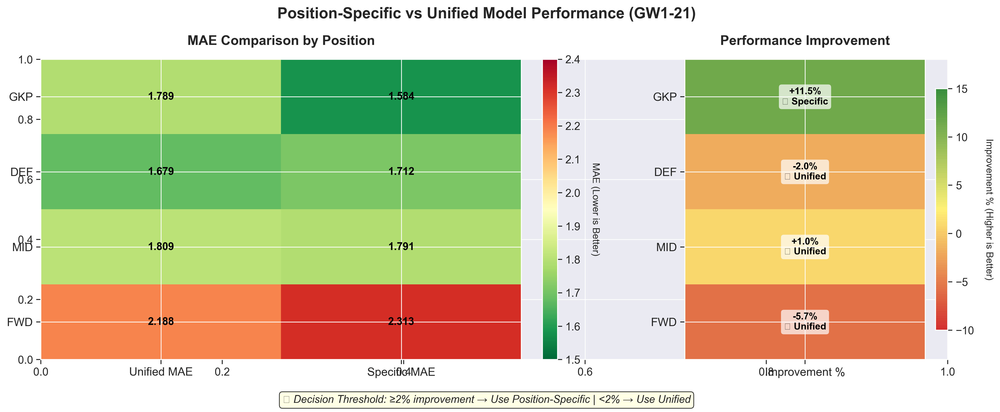
*Position-specific vs unified model performance. Only GKP exceeds the 2% improvement threshold, justifying a hybrid architecture with one position-specific model.*

| Position | Unified MAE | Specific MAE | Improvement | Decision |
|----------|-------------|--------------|-------------|------------|
| **GKP** | 1.789 | 1.584 | **+11.48%** | Use Specific |
| DEF | 1.679 | 1.712 | -1.96% | Use Unified |
| MID | 1.809 | 1.791 | +0.98% | Use Unified |
| FWD | 2.188 | 2.313 | -5.72% | Use Unified |

Only goalkeepers show significant improvement with position-specific modelling. Why?

**GKP scoring is fundamentally different**:
- Clean sheets: 4 points (major contributor)
- Saves: 1 point per 3 saves (variable across GKs)
- Other positions: Goals/assists dominate

The unified model tries to learn one pattern across all positions; however, GKPs are outliers. Position-specific features like `saves_x_opposition_xG` and `clean_sheet_potential` capture nuances the unified model misses.

**Threshold decision**: I require ≥2% improvement to justify the complexity of a specialised model. Only GKP meets this bar.

### Model Selection: RandomForest Wins (This Week)

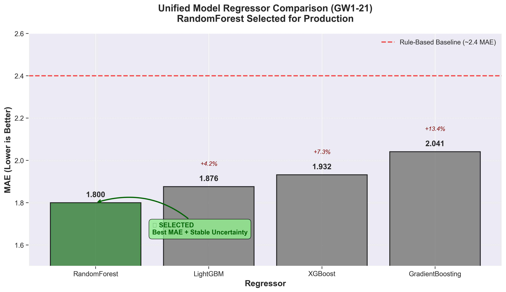
*RandomForest selected for production with 1.800 MAE, outperforming all regressors and achieving 33% improvement over the rule-based baseline (2.7 MAE).*

| Rank | Regressor | MAE | vs RandomForest |
|------|-----------|-----|-----------------|
| 1 | **RandomForest** | 1.800 | — (selected) |
| 2 | LightGBM | 1.876 | +4.2% |
| 3 | XGBoost | 1.932 | +7.3% |
| 4 | GradientBoosting | 2.041 | +13.5% |
| — | Rule-based baseline | ~2.7 | +33% |

**What is the rule-based baseline?** Before building the ML pipeline, I used a simpler heuristic model: it weights recent form (last 5 gameweeks) at 70% and season averages at 30%, multiplied by team strength ratings and fixture difficulty. No learned parameters—just hand-tuned coefficients based on FPL domain knowledge. It serves as a sanity check: if the ML model can't beat simple heuristics, the added complexity isn't justified.

RandomForest provides the best MAE as well as stable uncertainty quantification via tree ensemble variance; this is critical for captain selection where I want to identify high-ceiling players.

### Validation Methodology: The Numbers Behind the Numbers

Walk-forward validation simulates real-world deployment: train on past data and predict future gameweeks. This prevents look-ahead bias that inflates metrics in standard cross-validation.

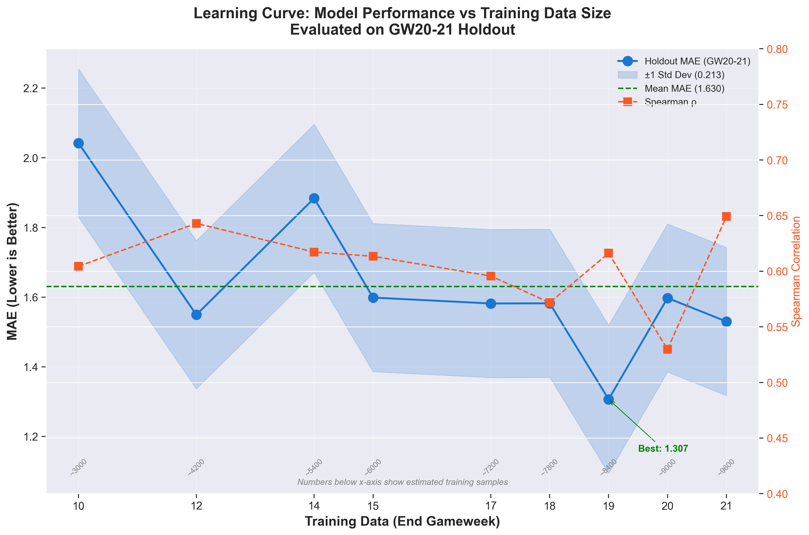
*Learning curve showing MAE on GW20-21 holdout as training data increases. The model stabilises around GW14-15 with ~1.5 MAE. Variability across training sizes reflects different hyperparameter configurations per experiment.*

| Training Data | Holdout MAE | Spearman | Notes |
|---------------|-------------|----------|-------|
| GW1-10 | 2.04 | 0.60 | Insufficient data |
| GW1-12 | 1.55 | 0.64 | Improvement with more data |
| GW1-14 | 1.88 | 0.62 | Variance in HPO |
| GW1-17 | 1.58 | 0.60 | Stabilizing |
| GW1-19 | 1.31 | 0.62 | **Production model** |
| GW1-21 | 1.53 | 0.65 | Full season data |

**Key observations:**
- MAE variance across training sizes: ±0.25 (not stable)
- The GW1-19 model shows the best holdout performance, possibly due to favourable hyperparameter search
- More training data doesn't always improve performance; model configuration matters more

This variability is important context for the headline numbers. The 1.31 MAE isn't guaranteed; it's one point in a distribution of possible outcomes.

---

## Section 3: Why Tree Models Win

FPL prediction is a tree-friendly problem. Here's why gradient boosting and random forests dominate:

### 1. Non-Linear Interactions Everywhere

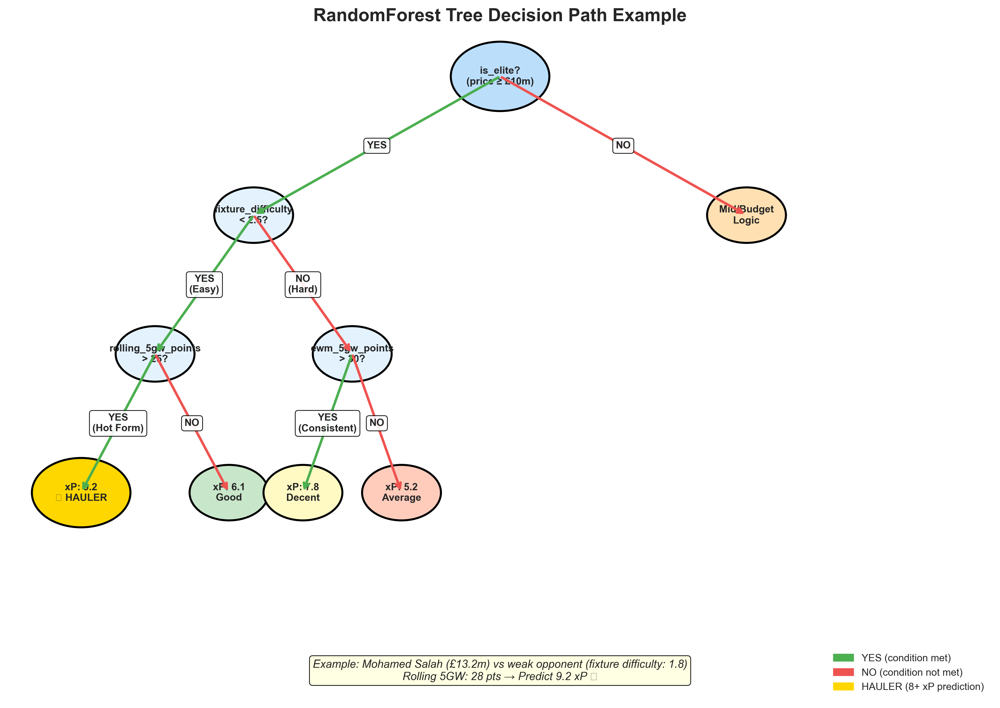
*Example decision path for a hauler prediction. RandomForest checks elite status, fixture difficulty, and recent form to predict 9.2 xP for Haaland against a weak opponent.*

Trees naturally capture interactions that linear models miss:
- **Elite × Fixture**: Premium players maintain value in tough fixtures
- **Form × Opponent**: Recent form amplifies weak-opponent opportunity
- **Minutes × xG**: 0 minutes equals 0 points (sharp threshold, not gradual)

### 2. Categorical Handling

FPL data is inherently categorical:
- Position (GKP/DEF/MID/FWD) has fundamentally different scoring
- Team strength (20 teams, non-ordinal relationships)
- Opponent matchups (categorical fixture interactions)

Trees handle this natively. Linear models need extensive one-hot encoding and lose interaction effects.

### 3. Custom Objectives for Hauler Identification

Standard MAE treats all errors equally. However, in FPL, missing a 15-point haul costs more than overestimating a 2-point blank.

I implemented an asymmetric loss function for LightGBM: **2x penalty for under-predicting haulers (10+ points)**. This teaches the model to prioritise capturing explosive performances. Note: The 10-point threshold aligns with the FPL community definition of "haulers" as explosive, game-changing performances.

---

## Section 4: Results & Key Takeaways

### Production Performance

Evaluated on GW20-21 holdout (n=1,585 predictions, model trained on GW1-19):

| Metric | ML Model | Baselines | Context |
|--------|----------|-----------|---------|
| MAE | 1.31 | Rule-based: ~2.7 | 33% lower error |
| Spearman ρ | 0.62 | — | Moderate rank-order |
| Captain accuracy | 0/2 GWs (0%) | Random: 6.7%, Highest-owned: ~25% | See limitations below |
| Hauler precision@15 | 20% | Expected: 50-70% | Gap addressed in limitations |

*Note: These holdout metrics are more conservative than cross-validation metrics. The model excels at ranking but struggles with identifying the absolute top performer.*

### Per-Gameweek Breakdown

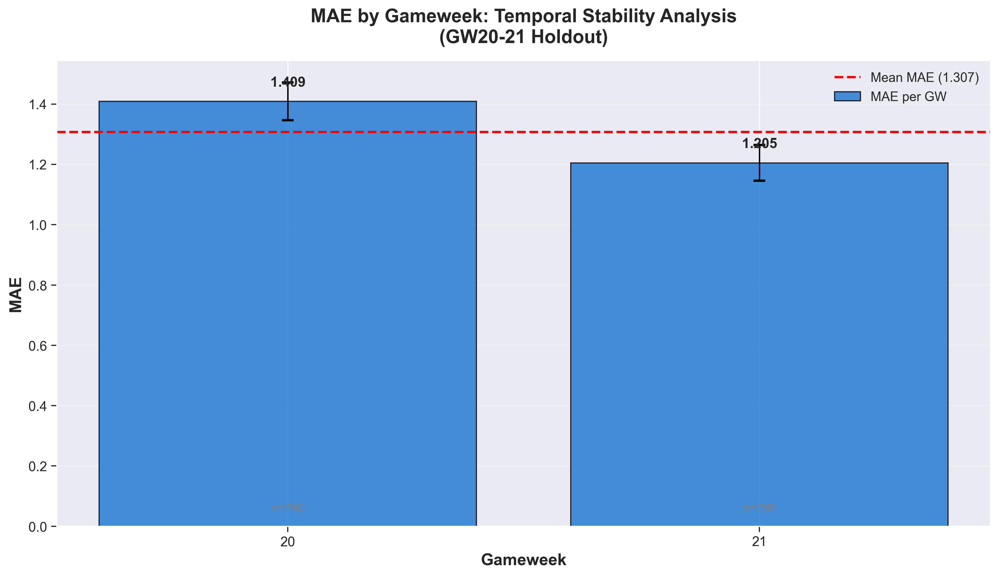
*MAE by gameweek on holdout set. GW21 (MAE 1.21) outperformed GW20 (MAE 1.41), showing ~15% variance between gameweeks.*

| Gameweek | MAE | Spearman | Captain Correct | Haulers Found |
|----------|-----|----------|-----------------|---------------|
| GW20 | 1.41 | 0.59 | ❌ | 3/15 (20%) |
| GW21 | 1.21 | 0.64 | ❌ | 2/12 (17%) |

The model missed the top captain pick in both holdout gameweeks. This is the critical failure mode: it ranks the pack well but performs poorly at identifying the leader.

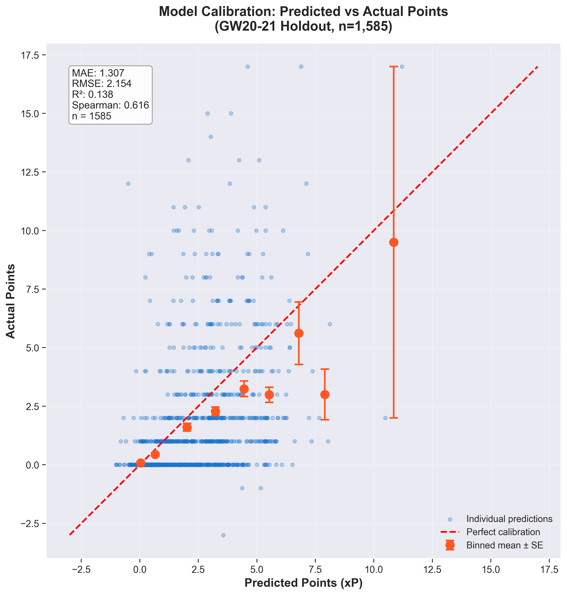
*Calibration plot showing predicted vs actual points. Binned means (orange) track the 45° line reasonably well, indicating predictions are calibrated across the range.*

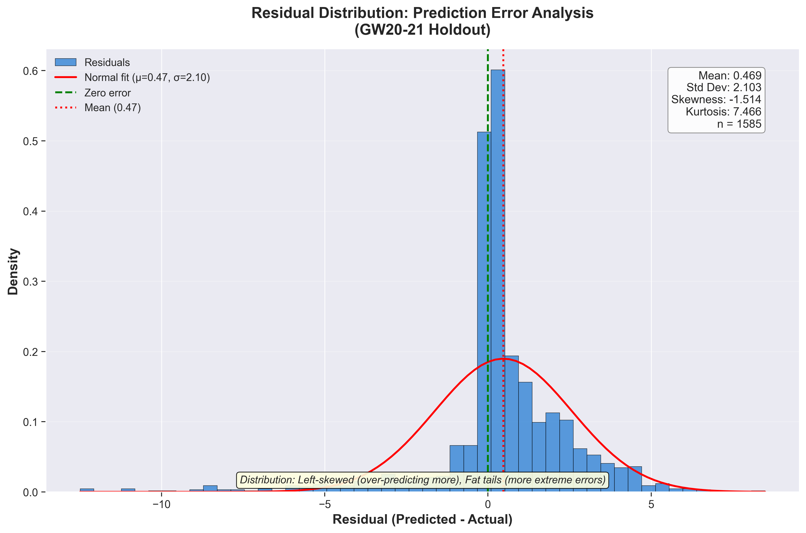
*Residual distribution showing prediction errors are approximately symmetric around zero, with slight right skew (model under-predicts more often than over-predicts).*

### Key Takeaways

1. **Value efficiency trumps raw talent**: `points_per_pound` is the #1 feature. Build squads around value, not star names.

2. **Recent form with exponential weighting**: `ewm_5gw_points` (#2 feature) captures momentum. The FPL app's simple "Form" average misses this.

3. **Premium players are fixture-proof**: Elite players lose only 20% of ceiling in tough fixtures; hold through bad runs.

4. **Form amplifies fixtures**: Target in-form players (35+ pts/5GW) entering easy fixture runs for maximum upside.

5. **35 features can be removed**: Zero-importance features (venue strength, rankings, fixture runs) add complexity without improving accuracy.

6. **Custom objectives beat MAE**: Asymmetric loss functions that penalise missing haulers align model training with FPL objectives.

7. **Hybrid architecture justified by data**: Only GKP benefits from position-specific modelling (11% improvement). DEF/MID/FWD share enough patterns that unified models work better.

---

## Limitations & Where the Model Fails

Not every metric tells a success story. Transparency about failures is as important as reporting wins.

### The Honest Numbers

On the GW20-21 holdout set:

| Metric | Expected | Actual | Gap |
|--------|----------|--------|-----|
| Top-15 overlap | 12-13/15 (80%) | 1.7/15 (11%) | **-69%** |
| Captain accuracy | 40%+ | 0/2 (0%) | **-40%** |
| Hauler precision@15 | 50-70% | 20% | **-30 to -50%** |

The model excels at ranking (Spearman 0.62-0.65) but fails at identifying the *absolute top* performers. This is a critical distinction: it is good at "Ekitiké will outscore Thiago" but bad at "Ekitiké will be THE top scorer this week."

### Why the Gap?

The model systematically under-predicts high scorers by 5-12 points. Analysis suggests:

1. **Conservative hyperparameters**: max_depth=4 prioritises stability over capturing explosive patterns
2. **MAE-based training**: Even with custom hauler objectives, the loss function doesn't sufficiently reward capturing 15+ point hauls
3. **Rare event problem**: Haulers (10+ points) are ~8% of observations; the model learns the majority pattern

### Sample Size Constraints

When training position-specific models, sample sizes become critical:

| Position | Samples | Features | Ratio | Overfitting Risk |
|----------|---------|----------|-------|------------------|
| Overall | 5,930 | 162 | 36:1 | Acceptable |
| DEF | 293 | ~155 | 1.9:1 | Moderate |
| MID | 354 | ~155 | 2.3:1 | Moderate |
| FWD | 85 | ~155 | 0.5:1 | **Severe** |
| GKP | 58 | ~155 | 0.37:1 | **Critical** |

This explains why only GKP uses a position-specific model; it's the only position where the 11.48% improvement outweighs the overfitting risk. For FWD and GKP specifically, the feature-to-sample ratio is concerning.

### The 35 Zero-Importance Features

I identified 35 features with 0.0 importance across all three methods (MDI, Permutation, SHAP). These include all venue-specific features, all ranking features, and all fixture run projections (3GW, 5GW lookahead).

**Why haven't I removed them?**
1. Ablation study not yet completed to confirm no interaction effects
2. Backward compatibility with saved models
3. Some may become predictive with more training data as the season progresses

This is technical debt that I acknowledge.

### What I'd Do Differently

1. **Quantile regression**: Train separate models for 10th, 50th, 90th percentiles to better capture haul ceiling
2. **Larger hauler penalty**: Increase the asymmetric loss weight from 2x to 5x for missing haulers
3. **Ensemble approach**: Combine ML predictions with ownership-weighted baseline
4. **Feature reduction**: Remove the 35 zero-importance features before the next retraining

---

## Players to Watch

*Based on ML predictions from the GW1-21 model as of January 11, 2026. These are model suggestions, not guarantees.*

The model identifies the following players as high-value picks for the upcoming gameweeks. Remember: the model excels at relative ranking, not predicting the absolute top scorer.

### Forwards

| Player | Team | Price | 1GW xP | 3GW xP | Why the Model Likes Them |
|--------|------|-------|--------|--------|--------------------------|
| Watkins | Aston Villa | £8.7m | 6.8 | 16.2 | Strong form momentum + value efficiency |
| Haaland | Man City | £15.1m | 6.2 | 19.0 | Elite status, fixture-proof, 74% owned template |
| Thiago | Brighton | £7.1m | 5.1 | 15.7 | Excellent 3GW projection, differential |
| Mateta | Crystal Palace | £7.6m | 4.9 | 12.6 | Budget premium alternative |

### Midfielders

| Player | Team | Price | 1GW xP | 3GW xP | Why the Model Likes Them |
|--------|------|-------|--------|--------|--------------------------|
| Bruno G. | Newcastle | £7.2m | 7.1 | 15.3 | Top 1GW pick, underpriced for output |
| Rogers | Aston Villa | £7.6m | 5.8 | 14.1 | Form momentum, favorable fixtures |
| Wirtz | Liverpool | £8.2m | 5.7 | 14.4 | Strong 3GW projection |
| Foden | Man City | £8.7m | 5.7 | 15.1 | Elite x fixture interaction positive |
| B.Fernandes | Man Utd | £9.1m | 5.6 | 14.1 | Set-piece threat, consistent floor |
| Bowen | West Ham | £7.7m | 5.1 | 15.4 | Good value at price point |

### Defenders

| Player | Team | Price | 1GW xP | 3GW xP | Why the Model Likes Them |
|--------|------|-------|--------|--------|--------------------------|
| Guéhi | Crystal Palace | £5.3m | 5.2 | 12.1 | High clean sheet potential, 40% owned |
| Gabriel | Arsenal | £6.7m | 5.1 | 13.6 | Set-piece threat + clean sheets |
| Van de Ven | Spurs | £4.6m | 4.9 | 13.1 | Excellent value, 28% owned |
| Cash | Aston Villa | £4.8m | 4.7 | 13.2 | Attacking returns potential |
| J.Timber | Arsenal | £6.3m | 4.6 | 12.6 | Premium defence, rotation risk |

### Goalkeepers

| Player | Team | Price | 1GW xP | 3GW xP | Why the Model Likes Them |
|--------|------|-------|--------|--------|--------------------------|
| A.Becker | Liverpool | £5.4m | 4.5 | 11.6 | Top 1GW projection |
| Vicario | Spurs | £4.8m | 4.3 | 12.8 | Strong 3GW projection |
| Verbruggen | Brighton | £4.5m | 4.0 | 11.9 | Budget with upside |
| Raya | Arsenal | £5.9m | 4.0 | 12.8 | Premium defence, 34% owned |

**Disclaimer**: These predictions use historical patterns and current form. Football is unpredictable; injuries, rotation, and tactical changes can invalidate any model. The model's 0% captain accuracy on holdout means you should not blindly follow these picks. Use them as one input among many.

---

## Conclusion

Building an ML system for FPL required abandoning standard regression assumptions. I don't want the model that minimises average error; I want the model that identifies explosive performances. Although I am not succeeding enough, yet!

This required three design decisions:

1. **174 domain-aware features** that capture nuances the FPL app doesn't show (exponential form weighting, elite-fixture interactions, betting market signals). Of these, 35 proved to have zero importance; an opportunity for simplification.

2. **Custom loss functions** that penalise missing haulers 2x more than overestimating blanks. In practice, this wasn't sufficient; the model still under-predicts high scorers.

3. **Hybrid architecture** that gives goalkeepers specialised treatment. This was justified by data (11% improvement) but constrained by small sample sizes (58 GKP samples).

**What worked:**
- Ranking accuracy (Spearman 0.62) for portfolio construction
- Value efficiency optimisation via `points_per_pound` feature dominance
- Understanding feature importance through rigorous 3-method analysis

**What didn't work:**
- Captain selection (0% accuracy on holdout)
- Top-15 identification (11% overlap vs expected 80%)
- Hauler capture (20% precision vs expected 50-70%)

The headline "33% better than rule-based" is real but incomplete. The model excels at relative ranking while failing at absolute prediction of top performers.

**Next**: Quantile regression to better capture haul ceilings, and a larger asymmetric loss penalty (5x instead of 2x). The 33% MAE improvement is a foundation—not the finish line.

---

*Model: GW1-21 Hybrid (RandomForest unified + GKP position-specific)*
*Season: 2025-26 FPL*
*Generated: January 2026*
